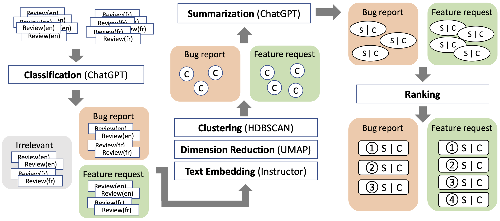

# Mini-BAR

Mini-BAR is a tool for the mining of bilingual app reviews.


If you find our work useful, please cite our paper:

```bibtex
@INPROCEEDINGS{Wei2023ICTAI,
  author = {Jialiang Wei and Anne-Lise Courbis and Thomas Lambolais and Binbin Xu and Pierre Louis Bernard and Gérard Dray},
  title = {Zero-shot Bilingual App Reviews Mining with
Large Language Models},
  booktitle = {35th IEEE International Conference on Tools with Artificial Intelligence (ICTAI)},
  year = {2023}
}
```

## Dataset
### Classification
| App            | Total | Feature request | Problem report | Irrelevant |
| -------------- | ---- | ---- | ---- | ---- |
| Garmin Connect (en) | 2000  | 223   | 579        | 1231            |
| Garmin Connect (fr) | 2000  | 217   | 772        | 1051            |
| Huawei Health (en)  | 2000  | 415   | 876        | 764             |
| Huawei Health (fr)  | 2000  | 387   | 842        | 817             |
| Samsung Health (en) | 2000  | 528   | 500        | 990             |
| Samsung Health (fr) | 2000  | 496   | 492        | 1047            |

The sum of each category does not equal the total of reviews, as some reviews have been assigned to more than one label.

### Clustering
|            | Garmin Connect | Huawei Health | Samsung Health |
| -------------- | ---- | ---- | ---- | 
| #clusters in feature request | 89  | 74   | 69        |
| #clusters($size\geq5$) in feature request | 7   | 9    | 11        |
| #clusters in problem report  | 45  | 44   | 41        |
| #clusters($size\geq5$) in problem report  | 10  | 13   | 12        |


## Installation

Create a new conda env 
```
conda create --name mini-bar python=3.9
``````

Activate the conda env 
```
conda activate mini-bar
```

Install the required libs
```
pip install -r requirements.txt
```

Copy your OpenAI key (https://platform.openai.com/account/api-keys) to the environment variable `OPENAI_API_KEY`
```
export OPENAI_API_KEY='your openai key'
```

## Experiments

### Classification

#### Pre-trained models and Machine Learning models

Create a new conda env, this env is only used for the experiments of classification
```
conda create --name mini-bar-cls python=3.9
```

Activate the conda env 
```
conda activate mini-bar-cls
```

Install the required libs 
```
pip install -r requirements-cls.txt
```

Change the current working directory
```
cd classification
```

Train and test deep learning based models. `nohup` is used to keep the script running even after exiting the shell
```
nohup python dl_train.py &
```

Train and test machine learning based models
```
nohup python ml_train_test.py &
```

The precision, recall and f1 are saved in the log file in `classification/lightning_logs`

#### Large language models

Activate the conda env 
```
conda activate mini-bar
```

Test with large language models
```
nohup python llm.py &
```

Calculate precision, recall and f1
```
python llm_analyse.py --csv_path csv_file_path --model "model name (chatgpt or guanaco)"
```

### Clustering

Activate the conda env 
```
conda activate mini-bar
```

Change the current working directory by 
```
cd clustering
```

Perform text embedding and dimension reduction for the data in `dataset/for_clustering/labelled`, the results will be saved in `dataset/for_clustering/embedded`
```
python embed_script.py
```

Cluster the text embedding stored in `dataset/for_clustering/embedded`
```
python main.py
```

Evaluate the clustering results in `clustering/output/multi-hdbscan`
```
python evaluate.py --name "multi-hdbscan" --length 1 --scale 10
```

### Summarization

Activate the conda env 
```
conda activate mini-bar
```

Summarize the reviews
```
python summarizer.py
```

## Usage

Activate the conda env 
```
conda activate mini-bar
```

Change the current working directory 
```
cd tool
```

Perform analysis on a csv file
```
python mini_bar.py --file csv_file_path
```

Generate the report
```
python report.py
```